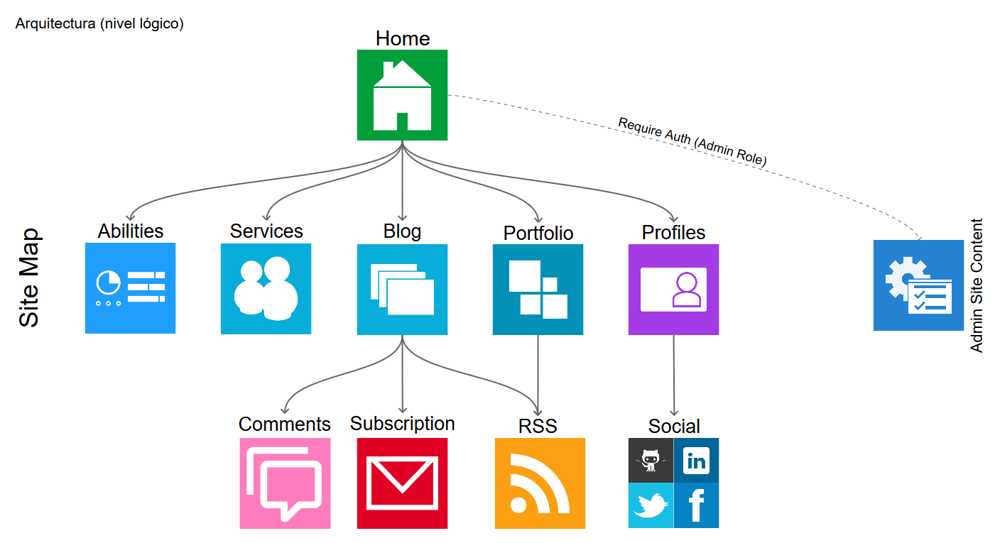
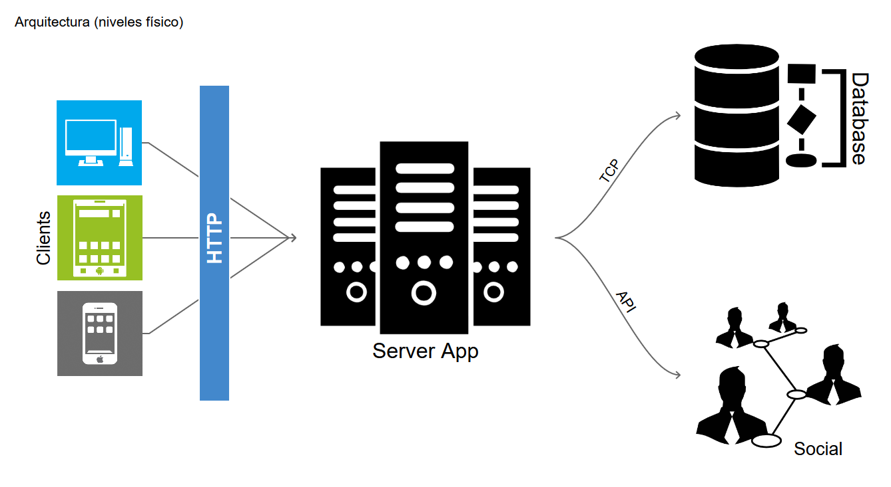

# FSDTeam

Full Stack Development Team website

El objetivo general de este proyecto es poder contar con un sitio web donde se publicar información, habilidades, conocimientos y trabajos realizados por los equipos de desarrollo.

# Informacion

El sistema esta desarrollado con frameworks y plugins con una gran aceptacion en la comunidad.

## Frameworks 

* Ruby on Rails 4.2.0
* JQuery 1.12
* Bootstrap 3.4.6

## Plugins

* jQuery.countTo
* [jQuery.easing] (http://gsgd.co.uk/sandbox/jquery/easing/)
* [jQuery.masonry] (http://masonry.desandro.com) 
* [jQuery.scrollto] (https://github.com/yckart/jquery.scrollto.js)
* [jQuery.stellar] (http://markdalgleish.com/projects/stellar.js)
* Modernizr

## Recursos

### Iconos

* Fontawesome 4.2

### Fuentes

* Roboto 
* Raleway

# Dependecias  

Para el desarrollo del sitio se utilizaron las siguientes gemas:

* Devise (Autenticacion)
* Parperclip o Carrewave (Ficheros)
* CanCanCan (Autorizacion)

# Funcionalidades

El sistema cuenta actualmente con un ACL para los miembros del equipo

### Funcionalidades Futuras

* Porfolio del equipo
* Blog
* Servicios brindados
* Habilidades de los miembros y del equipo
* Perfil de los Miembros
* Integracion con los perfiles de las redes sociales
* Gestion de los miembros, habilidades, servicios y perfiles de los miembros

# Arquitectura

Arquitectura interna del sistema

 

 

